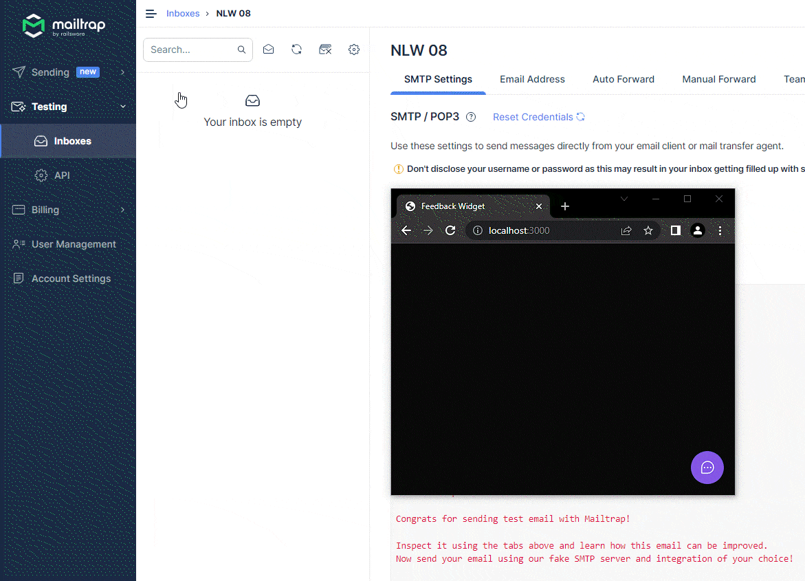
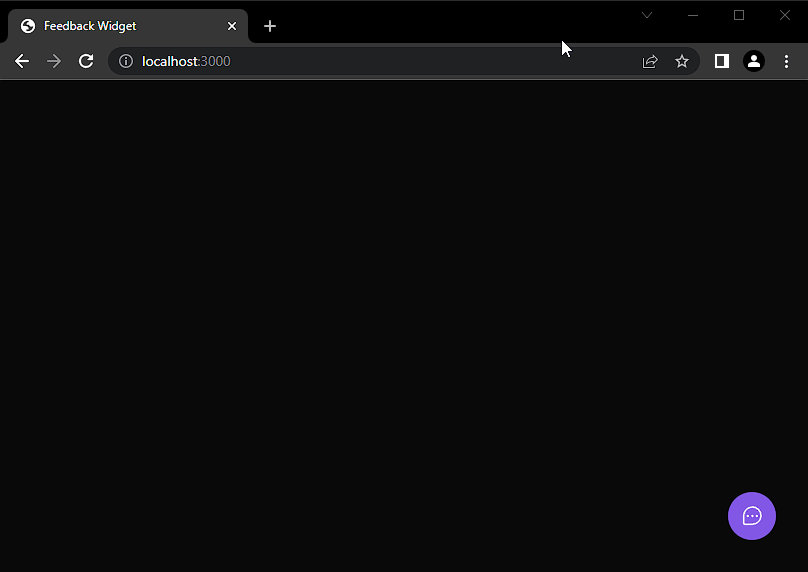

#  Feedback Widget 
  Este projeto, que foi desenvolvido para o evento Next Level Week #8 da Rocketseat, se trata de um widget que recebe bugs e sugestões enviadas por usuários e os armazena em um banco de dados, além de enviar um email contendo o tipo, descrição e screenshot desses feedbacks.

Caso queira conferir, se encontra disponível <a href="https://feedback-widget-maoiki.vercel.app/" target="_blank"> aqui! </a>

## :man_technologist: Demonstração

## :wrench: Tecnologias e ferramentas utilizadas:

### Web

- ReactJS
- Vite
- Tailwind
### Back-end
- Node.js
- Prisma
- Express
- Mailtrap
- Jest
- PostgreSQL

### Mobile
- Expo
- React Native

### Deploy
- Railway
- Vercel

## :dark_sunglasses: Responsividade e acessibilidade

Todo o projeto tem foco em ser responsivo e acessível, então existiu o cuidado em relação ao nível de contraste entre elementos, acesso a todas as funcionalidades utilizando apenas o teclado, melhorias para leitores de tela, etc. 

